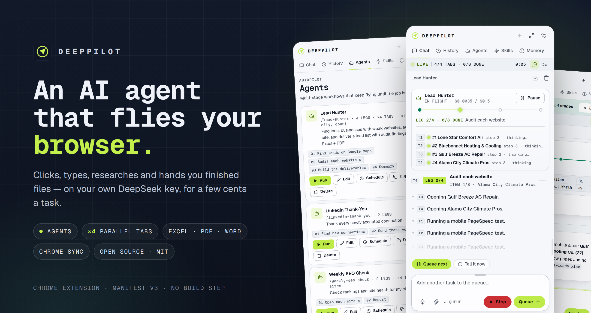
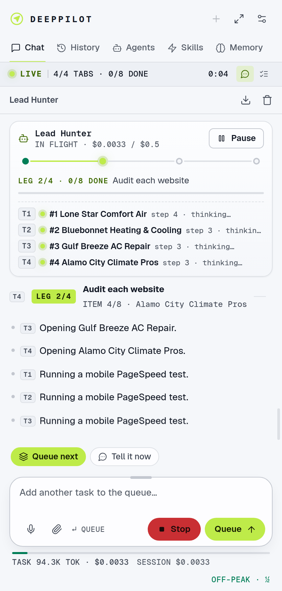
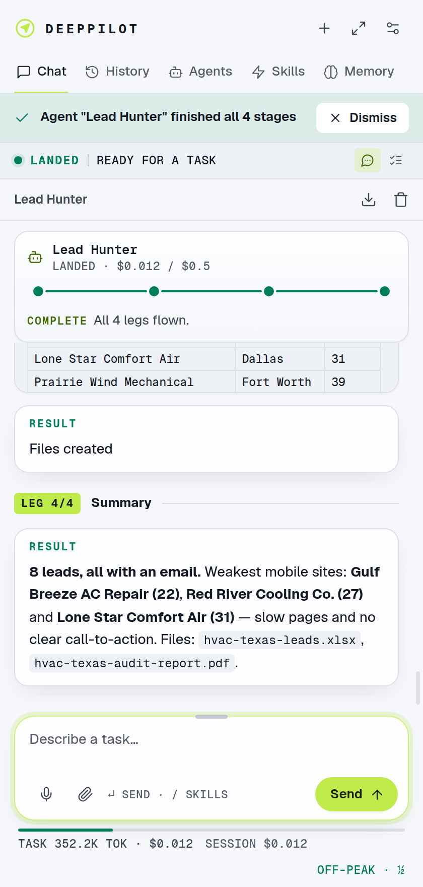
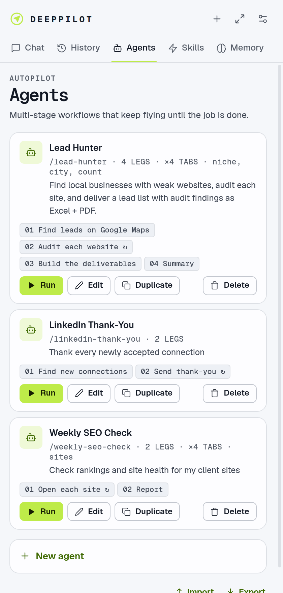
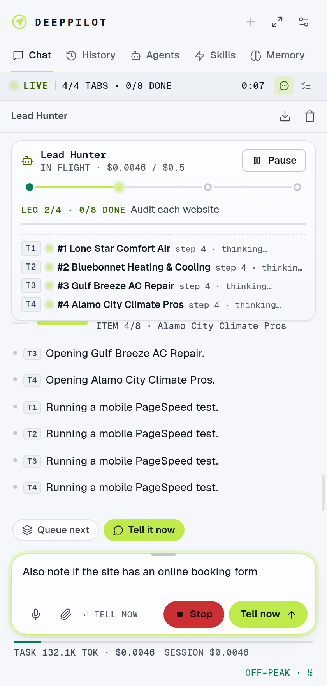
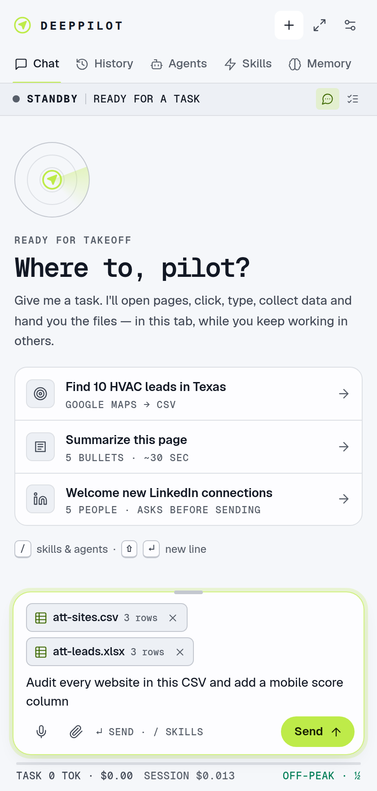
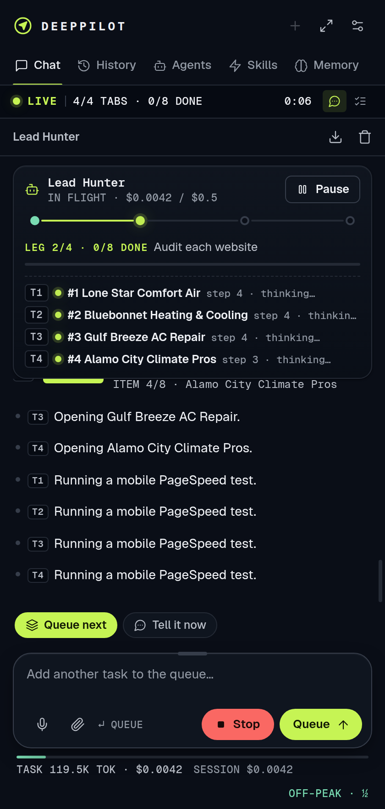
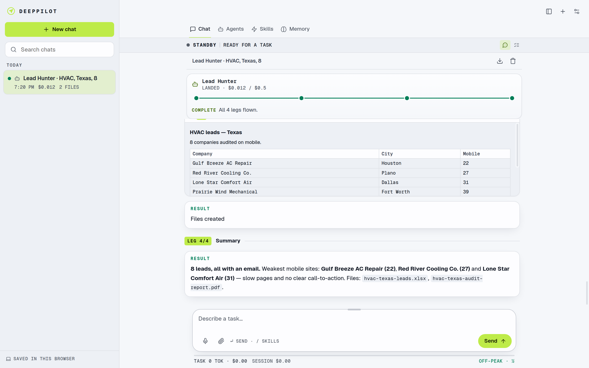

<div align="center">



# DeepPilot

**An AI agent that flies your browser — powered by your own DeepSeek key.**<br>
It opens pages, clicks, types, researches, fills forms and hands you finished Excel, PDF and Word files —<br>
in its own background tabs, while you keep working in the others. A typical task costs a few cents.

[](https://github.com/NahidDesigner/deeppilot/actions/workflows/ci.yml)
[](https://github.com/NahidDesigner/deeppilot/releases/latest)


[](LICENSE)

[**Install**](#-install-in-2-minutes) · [**Features**](#-what-it-can-do) · [**Agents**](docs/agents.md) · [**Speed & performance**](#-speed--performance) · [**Costs**](#-what-it-costs) · [**User guide**](docs/user-guide.md) · [**FAQ**](docs/troubleshooting.md)

</div>

---

## Why DeepPilot

Browser agents like Claude in Chrome are brilliant — and priced out of reach for a lot of people. DeepPilot gives you the same way of working (a panel next to any tab that does the clicking for you) on **DeepSeek**, where a full multi-step task usually costs **1–3 cents**.

- **Bring your own key.** No DeepPilot account, no middleman server. Your key, history and files stay in your browser.
- **Works where you're already logged in.** LinkedIn, Gmail, WordPress, ChatGPT, Google Maps — it uses your existing sessions.
- **Built for real work, not demos.** Multi-stage **Agents**, **parallel tabs**, a task queue, retries, pause & resume, a live cost meter and real file output.

<!--
  DEMO VIDEO — on GitHub, edit this file, drag your .mp4 (under 100 MB) onto the empty line below
  and GitHub turns it into an inline player. Then delete this comment.
-->

## ✦ What it can do

<table>
<tr>
<td width="50%" valign="top">

### 🧭 Real browser control
Real mouse and keyboard input through Chrome's DevTools protocol, a numbered map of every clickable element, screenshots when the page changes, and a visible cursor so you can watch it work. It works in **its own background tab** — it never steals your focus.

</td>
<td width="50%" valign="top">

### 🤖 Agents
Save multi-stage workflows — *find leads → audit each website → build Excel + PDF → summarize* — and run them with one click or `/lead-hunter city="Dallas"`. Loops over every item, retries failures, respects a cost limit, and pauses & resumes (even after a browser restart). Describe one in a sentence and **Draft with AI** writes it.

</td>
</tr>
<tr>
<td valign="top">

### ⚡ Parallel tabs
When a job has many independent items — audit 10 websites, find the email on every company site — DeepPilot **decides by itself** to split them across up to 10 background tabs working at the same time, then continues with all the results. LinkedIn, Facebook and messaging always stay one-at-a-time.

</td>
<td valign="top">

### 📄 Real files, both ways
Creates **Excel, PDF, Word, CSV**, JSON and any text format. **Attach** CSV, Excel, Word or text files to a message (📎, drag & drop or paste) and it reads them. Saves images from pages and uploads files into any website's upload box — e.g. make an image on ChatGPT and set it as a WordPress featured image.

</td>
</tr>
<tr>
<td valign="top">

### 🎛️ Stay in control
**Tell it now** — send new info to a running task (every tab gets it). **Pause** an agent, type what changed and **Update & resume**. A **queue** for the next tasks. It asks before buying, sending, deleting or posting.

</td>
<td valign="top">

### 🔄 Your data, everywhere
Memory, skills, agents and settings **sync between your computers through Chrome Sync** — no server, no setup. Full history with every file, searchable, grouped by day, with an optional cloud copy in *your own* Supabase project. One-file backup & restore.

</td>
</tr>
<tr>
<td valign="top">

### 🧠 Memory & skills
*"Remember my welcome template…"* — used in every future task. Save any task as a **skill** and run it again with `/name`.

</td>
<td valign="top">

### 🛫 A cockpit, not a chat box
Live telemetry (status · step · elapsed), agent runs drawn as a flight path with one lane per tab, alarms with selectable sounds, desktop notifications, voice input (Whisper — including বাংলা and South-Asian English), light and dark themes.

</td>
</tr>
</table>

<p align="center">
  
  
  
</p>
<p align="center">
  
  
  
</p>

<p align="center"></p>

## 🚀 Install in 2 minutes

1. **Download** the latest `deeppilot-vX.Y.Z.zip` from [**Releases**](https://github.com/NahidDesigner/deeppilot/releases/latest) and unzip it (or `git clone` this repository).
2. Open **`chrome://extensions`**, switch on **Developer mode** (top right), click **Load unpacked** and select the `deeppilot` folder.
3. **Pin** DeepPilot in the toolbar, open any tab and click the icon — or press <kbd>Ctrl</kbd>/<kbd>⌘</kbd> + <kbd>Shift</kbd> + <kbd>E</kbd>.
4. Open **Settings → DeepSeek**, paste your API key from [platform.deepseek.com](https://platform.deepseek.com), click **Test connection**, then **Save settings**.

That's it. Try: *"Find 10 HVAC companies in Dallas on Google Maps and give me a CSV with name, website, email, phone and Maps URL."*

> Works in Chrome 120+ and other Chromium browsers that support extension side panels (such as Edge and Brave). Chrome Sync needs Chrome signed in with **Extensions** included in sync.

## 🏎️ Speed & performance

**How fast DeepPilot works depends mostly on your internet connection and your computer — not on DeepPilot itself.** Every step is a round trip: read the page → send it to DeepSeek → wait for the answer → act on the page. So the same task can take 3 minutes on one machine and 8 on another.

| What affects speed | Why | What helps |
|---|---|---|
| **Internet speed & latency** | Each step sends the page state to DeepSeek and waits for the reply; pages themselves must load. Slow, unstable or far-away connections add seconds to *every* step. | A stable wired or strong Wi-Fi connection. Avoid heavy downloads/streams while it works. |
| **Your computer (CPU & RAM)** | Each working tab is a full browser tab — roughly 150–400 MB of RAM — plus screenshots to encode. Parallel tabs multiply this. | Close tabs you don't need. Keep laptops plugged in (battery saver slows background tabs). |
| **Parallel tabs setting** | More tabs finish lists faster — until your machine or connection becomes the bottleneck. | **8 GB RAM:** 2–3 tabs · **16 GB:** 4–6 · **32 GB+:** up to 10. Default is 4. |
| **The websites** | Heavy sites (Google Maps, PageSpeed tests, LinkedIn) load and settle slowly; some limit automated activity. | Nothing to fix — DeepPilot waits for pages and limits tabs on sensitive sites. |
| **DeepSeek's response time** | Model thinking time varies with load; busy hours can be slower. | Off-peak hours are also 50% cheaper. |

Rules of thumb: a simple task is **1–3 minutes**, a 10-item research job **5–15 minutes** with parallel tabs. More on this in the [performance guide](docs/performance.md).

## 💸 What it costs

You pay DeepSeek directly for what you use (DeepPilot is free). The meter at the bottom shows tokens and dollars **per task and per session**, with DeepSeek's off-peak discount applied automatically.

- A typical 20–30 step task costs **about 1–3 ¢**; a 10-item agent run with files **5–15 ¢**.
- DeepPilot is built to be cheap: the history is kept *cache-friendly* (repeated parts cost ~2% of the normal price), screenshots are only sent when the page changes, and unchanged pages aren't re-sent.
- Set a **max cost per agent run** and a **budget per task** in Settings. Parallel tabs make runs faster, **not** more expensive — the same work, done sooner.

<sub>Prices as of September 2026 (DeepSeek-V4.1-Flash: $0.30 per 1M input tokens, $0.006 cached, $1.20 output; off-peak −50%). They are editable in Settings if DeepSeek changes them.</sub>

## 🧩 Other models

DeepPilot speaks the OpenAI-compatible API, so you can point **Settings → Base URL / Model** at other providers — OpenRouter, Groq, Together, a local **Ollama** server, and more. It is developed and tested with **DeepSeek**; other models work if they support tool calling (and images, for vision). See [the user guide](docs/user-guide.md#other-models).

## 🔐 Privacy & security

- Your API keys, history, memories, skills and agents are stored **locally in Chrome**. Nothing goes to a DeepPilot server — there isn't one.
- Page content and screenshots go **only** to the model endpoint you configure. Voice clips go to the transcription service you choose (Groq by default).
- Chrome Sync stores your memory/skills/agents/settings in **your own Google account**; API keys are excluded unless you opt in.
- Web pages are treated as data, never as instructions, and DeepPilot asks before purchases, sending, posting or deleting.
- It needs powerful permissions (debugger, all sites) to click like a human — [SECURITY.md](SECURITY.md) explains each one and how to report a vulnerability.

> ⚠️ Automating sites like LinkedIn, Facebook or Google may break their terms and can get accounts limited. Keep batches small and human-paced — DeepPilot helps by running those one at a time.

## 🏗️ How it works

```
 Side panel / full page  ──port──▶  Background service worker (engine)
 (the cockpit you see)               ├─ Session per tab: agent loop, queue, alarms, history
                                     ├─ Agents runner + parallel worker pool
                                     ├─ DeepSeek client: streaming, tool calling, vision, cache-friendly history
                                     ├─ Browser control: chrome.debugger (CDP) + scripting
                                     ├─ Chrome Sync + IndexedDB history (+ optional Supabase)
                                     └─ Offscreen helper: sounds + Excel/PDF/Word builder
```

Plain ES modules, **no build step** — edit a file, reload the extension. Read the [architecture guide](docs/architecture.md) for the full tour.

## 🧪 Development

```bash
git clone https://github.com/NahidDesigner/deeppilot && cd deeppilot
npm install            # only Playwright, for the tests
npm run check          # syntax, manifest, versions, secrets — no browser needed
npm test               # 14 end-to-end suites, fully offline (mock DeepSeek + mock websites)
npm run build          # dist/deeppilot-vX.Y.Z.zip
```

The end-to-end tests load the real extension into Chromium and drive it like a user — agents, parallel tabs, steering, attachments, Chrome Sync between two simulated computers and more — against a local mock of the DeepSeek API, so they need **no API key and no internet**. On Linux run them under `xvfb-run -a npm test`. See [CONTRIBUTING.md](CONTRIBUTING.md).

## 🗺️ Roadmap

- [ ] Chrome Web Store listing
- [ ] Reading PDFs and images you attach
- [ ] One-click Google Drive cloud history
- [ ] Scheduled agents (run every morning)
- [ ] iframe support

Ideas and votes welcome in [Discussions](https://github.com/NahidDesigner/deeppilot/discussions) and [Issues](https://github.com/NahidDesigner/deeppilot/issues).

## 🤝 Contributing

Issues and pull requests are very welcome — bug reports with steps and screenshots help most. Please read [CONTRIBUTING.md](CONTRIBUTING.md) and our [Code of Conduct](CODE_OF_CONDUCT.md).

## 📜 License

[MIT](LICENSE) © 2026 Nahid. Bundled libraries and fonts keep their own licenses — see [`vendor/LICENSES.txt`](vendor/LICENSES.txt) and [`fonts/OFL-Geist.txt`](fonts/OFL-Geist.txt).

<div align="center"><sub>Built in Bangladesh 🇧🇩 for everyone who wants a browser agent without the price tag.</sub></div>
