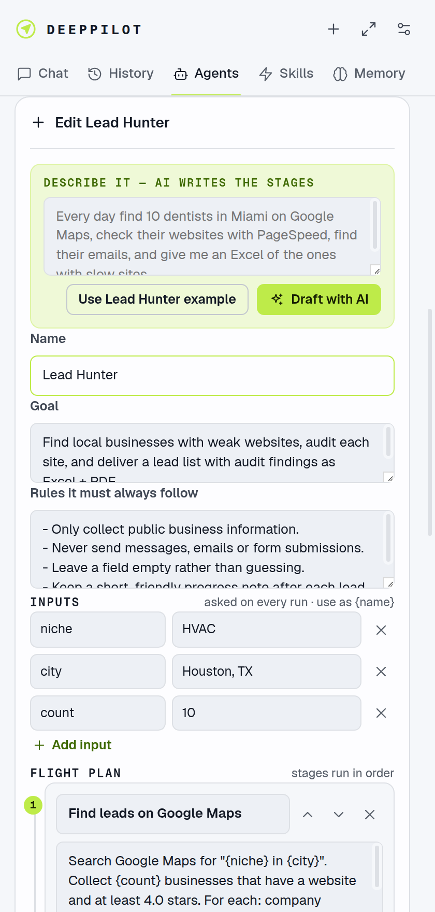

# Agents

An **agent** is a saved, multi-stage workflow that keeps going until the job is done. A good example is the built-in **Lead Hunter**:

1. **Find leads on Google Maps** saves a list of businesses.
2. **Audit each website** repeats for every business on that list, in parallel tabs.
3. **Build the deliverables** creates an Excel file and a PDF report from all the results.
4. **Summary** writes a short summary of what was found.

The logged-in sessions in your browser are the advantage: an agent can work on LinkedIn, Gmail, your WordPress admin or any SaaS dashboard, just as you would.

  

## Create one

**Agents** tab → **New agent**, then either:

- **Draft with AI**: describe the job in a sentence ("every Monday find 10 new dentists in Miami, check their sites and give me an Excel of the weak ones") and click **Draft with AI**. It fills in the stages, inputs and rules for you to review.
- **Use Lead Hunter example**: a complete, working example to adapt.
- Or write it yourself.

| Field | What it's for |
|---|---|
| **Name** | Also the command: *Lead Hunter* → `/lead-hunter` |
| **Goal** | What the whole agent achieves. Every stage sees it. |
| **Rules** | Constraints every stage must follow, e.g. *"Never send messages"*, *"Leave a field empty rather than guessing"* |
| **Inputs** | Values asked for on each run, used as `{name}` in the text, e.g. `{city}`, `{count}` |
| **Stages** | The flight plan, run in order. Each stage gets a fresh context, so long runs stay sharp and cheap. |
| **Repeat for each item** | Runs the stage once **per item** saved by an earlier stage |
| **One item at a time** | Turns parallel tabs off for this stage. Use it for messaging, posting or anything on a logged-in social account. |
| **Done when** | Optional: how the stage knows it's finished |
| **Max cost per run** | The run pauses when it reaches this, so you can decide whether to continue |
| **Max steps per stage** | Safety limit for a single stage (or item) |
| **Parallel tabs** | How many items a "for each" stage works on at once (1–10, default 4) |

### Writing stages that work

- **Be concrete.** Name the site or URL, what to click, what to collect.
- A stage that **finds a list** should end with *"call `save_items` with the list"*, one object per item with the fields you collected.
- A **for-each** stage works on the `CURRENT ITEM` only and should end with *"call `record_result` with: name, email, …"*, listing the fields.
- A stage that makes **files** should say which files and what goes in them: *"create `{niche}-{city}-leads.xlsx`, one row per business, sorted by lowest score"*.
- Keep stages focused. Three to six good stages beat one giant one.

## Run one

- From the **Agents** tab: **Run**, fill in the inputs and any extra instructions, then **Take off**.
- From the chat: `/lead-hunter niche=Plumbers city="Austin, TX" count=15 focus on older websites`. Unnamed words become extra instructions.

The **flight card** at the top shows the stages as waypoints, the current leg, the items done (e.g. `LEG 2/4 · 5/8 DONE`), the cost against the limit, and one lane per parallel tab.

## Change course

| You want to… | Do this |
|---|---|
| Add information while it runs | **Tell it now**: every running tab gets it on its next step; later items get it too |
| Stop and change the plan | **Pause**, type the change, and send with **Update & resume**. It continues where it stopped, with your update in every remaining stage. |
| Ask something without resuming | Pause, then choose **Just chat** |
| Continue after a problem | Fix it (e.g. log in), then **Resume**. Items that failed get another chance. |

Items that were already finished aren't redone. Updates apply to the remaining work.

## Reliability

- Each stage or item gets **up to 3 attempts**. With parallel tabs, an item that still fails is skipped and listed at the end of the stage. If most items fail (for example, you've been logged out), the run stops and asks for help instead of burning money.
- **Pause and resume survive a browser restart**: the run state is saved with the chat.
- Results are kept in item order, and an item that runs twice (retried or resumed) replaces its earlier result.

## Share agents

**Export** saves your agents as a JSON file; **Import** loads one. With Chrome Sync on, your agents also appear on your other computers automatically.
